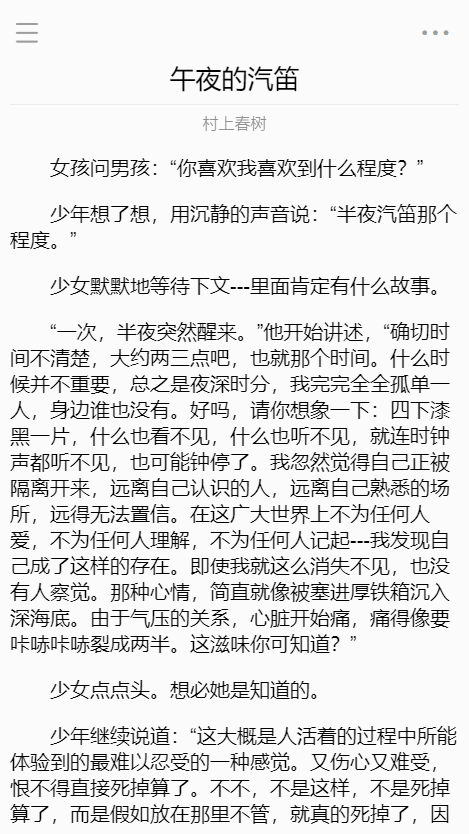
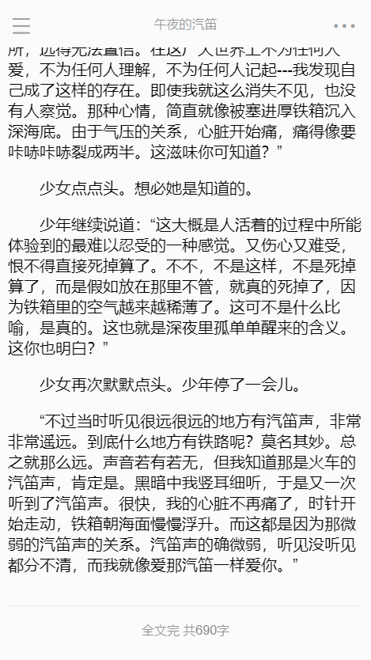
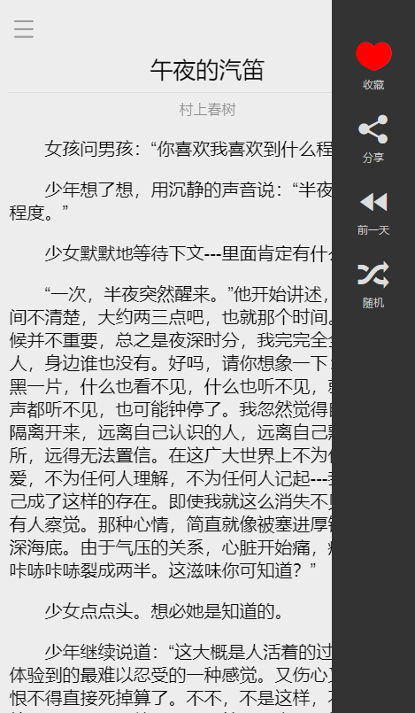
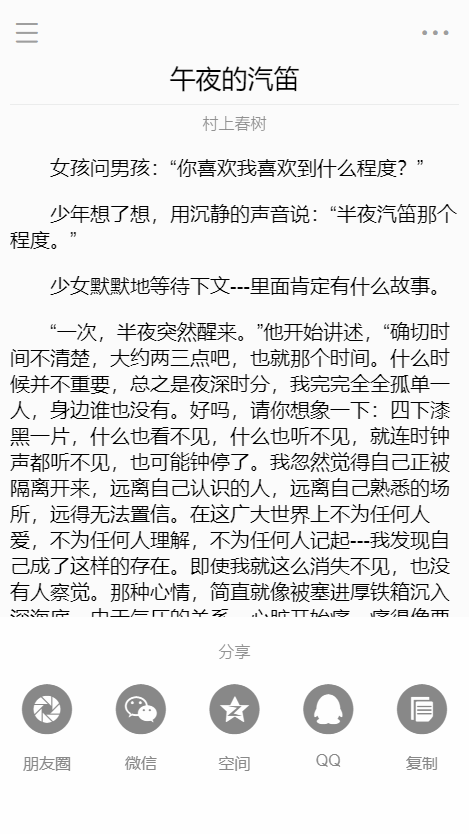
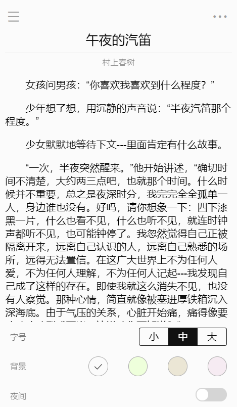
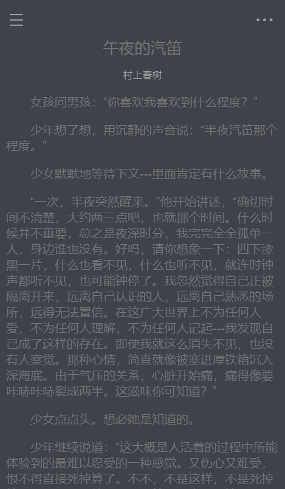
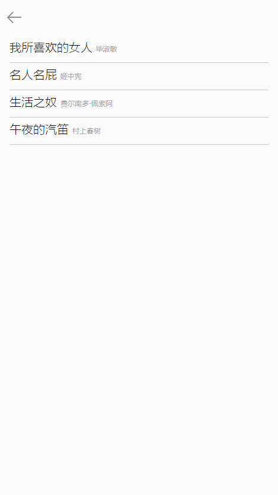

# daily-read

> A **FAKE** read app based on Vue.js
> Modle after [观止](https://www.wandoujia.com/apps/com.meiriyiwen.app)
> API Support: [https://github.com/jokermonn/-Api/blob/master/OneArticle.md](https://github.com/jokermonn/-Api/blob/master/OneArticle.md)

## Build Setup

``` bash
# install dependencies
npm install

# serve with hot reload at localhost:8080
npm run dev

# build for production with minification
npm run build
```

## Screenshot
</br>

<tr>
<td></td>
<td></td>
<td></td>
<td></td>
</tr>
<tr>
<td></td>
<td></td>
<td></td>
<td></td>
</tr>


